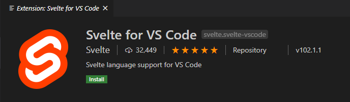

# Lesson1,2

## What is Svelte ?

* Compiler for creating reactive web apps & interfaces
    - reactive web apps 在 Vue 和 React 也有這些的功能
* can be used for small parts of a site, or entirely(SPA)

## Other Framework Differences

* Svelte is a compiler not a framework
* Svelte compiles your code for production at build time into a single, vanilla, JavaScript bundle
    - 它只 compile 一個檔案，如果是 React 和 Vue 還會把 library 載下來，速度上會有差異
    - smaller & faster
* No extra scripts or libraries are shipped to production
* Often results in a faster runnung website

## 需先安裝的開發套件

* Node v8以上
* VS Code 安裝以下此套件



## 建置專案

* https://svelte.dev/repl

    一種方法是找線上編輯器，直接在線上編輯，也可將其下載成 zip 檔放在 VS Code 裡。

* degit 

    另一種則是用 degit，目前不深究這方法與 git clone 有何差異，可看以下連結理解兩者間的差異為何 :
    > https://www.npmjs.com/package/degit
    
    再來繼續操作下去，使用以下指令 :
    ```
    npm install -g degit
    ```
    安裝好 degit 後，把當前位置換到想建置專案的地方，並使用以下指令 :
    ```
    degit sveltejs/template MyProject
    ```

上面兩種做法是把 sveltejs template repo 給拉下來，專案內容只是一個簡單的 Hello World 專案而已。雖然把專案拉了下來，不過 package.json 裡面的東西，還沒有安裝，因此在使用以下指令 :
```
npm install
```
然後啟動專案 :
```
npm run dev
```

這時專案應該會啟在 `http://localhost:5000`。

## 架構

先看 src 底下的兩個檔案 :
```
src
  |--App.svelte
  |--main.js
```
Svelte 也是用 Component 的形式來進行開發，App.svelte 是整個專案的根元件，裡面會分成三個部分 : 
1. `<script>`，會把 js code 寫在裡面。
2. `<main>`，裡面有 HTML 的架構。
3. `<style>`，裡面有樣版的部分。

main.js 是專案的啟動點，看看下面這段程式碼 :
``` JavaScript
import App from './App.svelte';

const app = new App({
	target: document.body,
	props: {
		name: 'world'
	}
});

export default app;
```
這裡有幾個要點 :
1. 程式碼的開頭 import 要用的 Component。
2. 下面的 new App 裡放的物件它要 render App Component，裡面的 target 代表當要 render 時，要 render 在哪個地方，AppComponent 通常會 render 在 document.body 上 ( 在`index.html` ) ，也可以用其他的 query selector 來替代，而 props 則是代表想要給 Component 的屬性，
3. App.svelte 會看到一個 `export let name`，記得要加上 `export` 關鍵字，這樣外部給予的 property 才會成功帶進來。

> 改成`export let name = 321;` 結果會是什麼 ?
> 若沒宣告變數，那Svelte會怎麼處理 ?

前面有提到，Svelte 會把檔案包成一個 bundle.js，在專案裡面有個 build 資料夾 :
```
build
  |--bundle.css
  |--bundle.css.map
  |--bundle.js
  |--bundle.js.map
```
在 AppComponent 寫好的 script 跟 css 分別會被包在 `bundle.css`、`bundle.js`，而 `index.html` 則會把這兩個都 include 進來 :
``` html
<head>
    <!-- 以上省略 -->
	<link rel='stylesheet' href='/build/bundle.css'>

	<script defer src='/build/bundle.js'></script>
    <!-- 以下省略 -->
</head>
```
