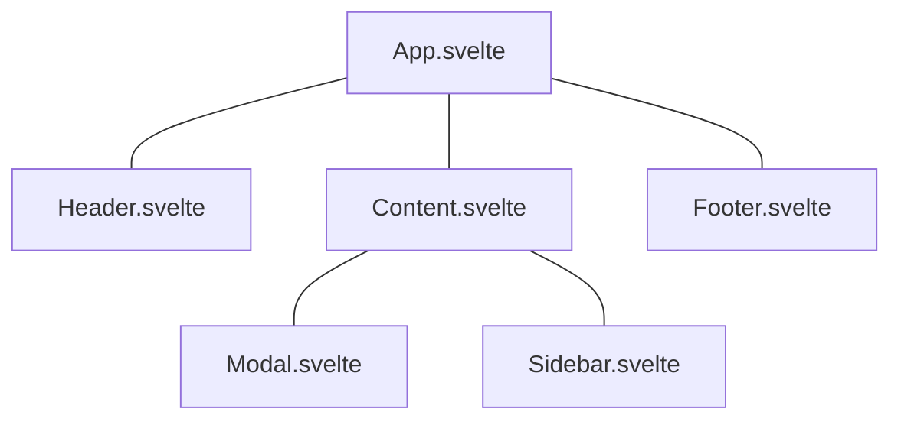

# Lesson9,10



Svelte 也是使用 Component 的形式來開發前端，而這種 Component 的 style，可讓能重複使用的元件抽出來，也能將每個元件要處理的事情分離開來，讓程式碼更好維護。

## Modal

來做一個彈跳視窗的 Component，在 src 底下新增 svelte 檔 :

``` 
src
  |--App.svelte
  |--main.js
  |--Modal.svelte
```

裡面寫一個簡單的架構，前面有提到基本上會是三個部分組成，這邊也一樣 :

``` html
<script>
</script>

<div class="backdrop">
    <div class="modal">
        <p>Sign up for offers!</p>
    </div>
</div>

<style>
</style>
```

下一步在 `App.svelte` 中使用它，這邊分兩個步驟 :

* import 要使用的 svelte，import 的名稱是可以隨意取的 ( 就算取成 Foo 也可以 ) ，只是要跟下面的 tag 一樣就行。
* 使用 tag 標籤來直接使用它。

``` html
<script>
    import Modal from './Modal.svelte';
    let people = [{
            name: 'yoshi',
            beltColour: 'black',
            age: 25,
            id: 1
        },
        {
            name: 'mario',
            beltColour: 'orange',
            age: 45,
            id: 2
        },
        {
            name: 'luigi',
            beltColour: 'brown',
            age: 35,
            id: 3
        }
    ];
    const handleClick = (e, id) => {
        people = people.filter(person => person.id != id);
        console.log(e);
    };
</script>

<Modal />
<!-- 以下省略 -->
```

再來，有時候可能會有一些情境，不同的人登入進來，會有不同的顯示畫面，來將前面用到的 `{#if}` 使用進來 :

``` html
<script>
    let showModal = true;
</script>

{#if showModal}
  <div class="backdrop">
    <div class="modal">
      <p>Sign up for offers!</p>
    </div>
  </div>
{/if}

<style>
</style>
```

## with CSS

下一步來看到 css 的部分，在專案資料夾裡有個 global.css，這檔案所調的樣式，會直接反映到所有的 Component 上，如果想要在各自的 Component 增加自己的 css，就在 Component 的第三個 part `<style>` 新增即可，Svelte 會隨機給它一個 class，並且包裝在 `bundle.css` ，可自行用開發人員工具去檢查。

給 Modal.svelte 一些樣式 :

``` html
<style>
    .backdrop {
        width: 100%;
        height: 100%;
        position: fixed;
        background: rgba(0, 0, 0, 0.8);
    }

    .modal {
        padding: 10px;
        border-radius: 10px;
        max-width: 400px;
        margin: 10% auto;
        ;
        text-align: center;
        background: white;
    }

    .promo .modal {
        background: crimson;
        color: white;
    }
</style>
```

這時可看到以下畫面 :


## Class

最後則是選擇性的給 Class :

``` html
<script>
    let showModal = true;
    let isPromo = true;
</script>

{#if showModal}
  <div class="backdrop" class:promo={isPromo}>
    <div class="modal">
      <p>Sign up for offers!</p>
    </div>
  </div>
{/if}
```

可看到多加了一個 `class:promo={isPromo}` ，這語法會依照後面插值的 boolean 值，來決定是否要添加此 class。
